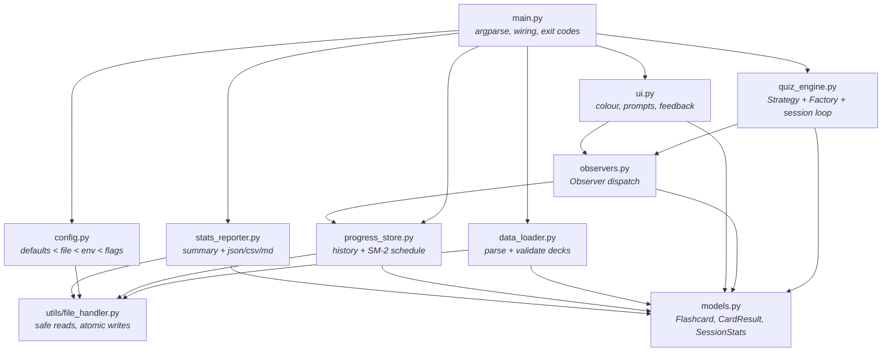
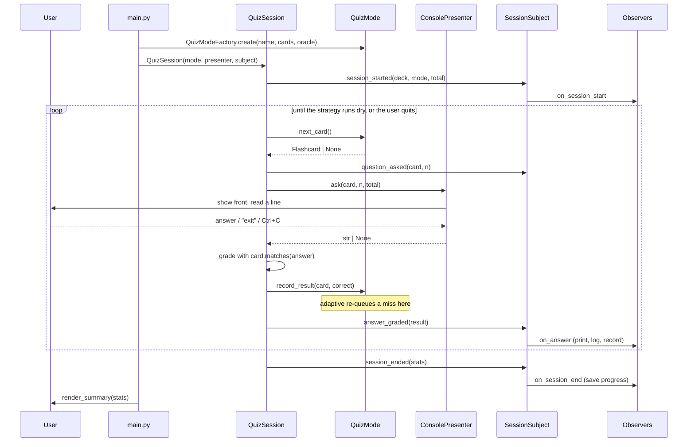

# Architecture

How the Flashcard Quizzer is put together, and why.

## Module map



Every arrow points downward: nothing below `main.py` imports anything above it,
and `models.py` imports nothing from the project at all. That is what makes the
lower modules testable in isolation.

## What runs during a quiz



## Design patterns

### Strategy — `QuizMode` and its four subclasses

The problem the brief sets is that sequential, random and adaptive are three
different algorithms for the same decision: *which card comes next*. Branching
on a mode string inside the loop would mean one function that knows about every
mode, growing a new branch for each.

`QuizMode` declares that decision as one method. `SequentialMode`,
`RandomMode`, `AdaptiveMode` and `SpacedRepetitionMode` each answer it their own
way. `QuizSession` holds a `QuizMode` and never asks which one it has.

The base class carries what every strategy shares — the queue, the question
limit, the repeat cap — so a subclass supplies only an ordering:

```python
@QuizModeFactory.register
class SequentialMode(QuizMode):
    name = "sequential"

    def build_queue(self) -> list[Flashcard]:
        return list(self._cards)
```

Adaptive mode additionally overrides `record_result` to push a missed card back
into the queue. That hook is the whole reason the strategy is told about
outcomes at all.

The pattern paid for itself concretely: `SpacedRepetitionMode` was added after
the engine, the CLI and the test suite were already written, and it required no
change to any of them. It appeared in `--help` and `--list-modes` on its own,
because both read from the factory.

### Factory — `QuizModeFactory`

The command line carries a string; the engine needs an object. The factory owns
that translation, and registration is a decorator, so the list of modes lives
next to the classes instead of in a second place that drifts out of date.

```python
mode = QuizModeFactory.create("adaptive", deck.cards, oracle=store, limit=10)
```

Three things read the registry rather than a hardcoded list: `--mode`'s accepted
values, the `--help` epilogue and `--list-modes`. Registering a class is
therefore the complete cost of adding a mode.

### Observer — `SessionSubject` and the observers

Three unrelated things should happen when a question is answered: feedback is
printed, a log line is written, and the long-term history is updated. Those have
nothing to do with each other and nothing to do with running a quiz.

The session announces what happened. `ConsoleObserver`, `LoggingObserver` and
`ProgressObserver` each decide what that means for them. `--no-progress` is
implemented by simply not attaching one observer.

`SessionSubject._dispatch` isolates each observer, because a bug in a logging
sink must not end someone's quiz:

```python
try:
    handler(*args)
except Exception:
    self._logger.exception("Observer %s failed handling %s", ...)
```

A test asserts exactly that: one exploding observer, and the other still
receives every answer.

## Decisions worth recording

**No runtime dependencies.** The quiz imports only the standard library.
`colorama` would have been the obvious way to get colour on Windows, but eight
ANSI escapes plus one `SetConsoleMode` call do the same job, and it means the
tool runs on a bare Python install. `requirements.txt` is development tooling
only.

**Cards are keyed on their question text, not their index.** `Flashcard.key` is
the normalized `front`. A progress record therefore survives reordering a deck
or inserting cards into the middle of it, which an index would not.

**The progress file degrades instead of failing.** A corrupt history produces a
warning and an empty store. The quiz is the point; the statistics are a
convenience, and refusing to run over a damaged convenience file would be the
wrong trade.

**Writes are atomic.** `write_json` writes to a temporary file in the
destination directory and then `os.replace`s it into position. The progress file
is rewritten after every session, so a crash mid-write would otherwise be able
to truncate it to nothing.

**Repeats are capped.** `MAX_REPEATS` bounds how often adaptive mode can
re-queue one card. Without it, a user who never answers a card correctly would
be in an infinite loop — the most dangerous failure the engine could have, and
the one with a test named after it.

**Deck files are size-capped.** `MAX_FILE_BYTES` refuses a file over 5 MB before
`json.load` tries to hold it in memory. A flashcard deck is kilobytes; anything
larger is a mistake or a hostile input.

## Testing approach

The engine depends on two protocols rather than on concrete classes:

- `AnswerProvider` — where answers come from. Production uses
  `ConsolePresenter`; the tests use a `ScriptedProvider` that replays a list.
- `DifficultyOracle` — a read-only view of card history. Production passes the
  `ProgressStore`; the mode tests pass a `FakeOracle` built from literals.

Nothing in `quiz_engine.py` calls `input()`, prints, or touches the disk, so the
whole engine is testable without capturing output or mocking builtins. The clock
is injected the same way, which is how the timing assertions are exact rather
than approximate.

Coverage sits at 97% of statements and branches across 227 tests.
